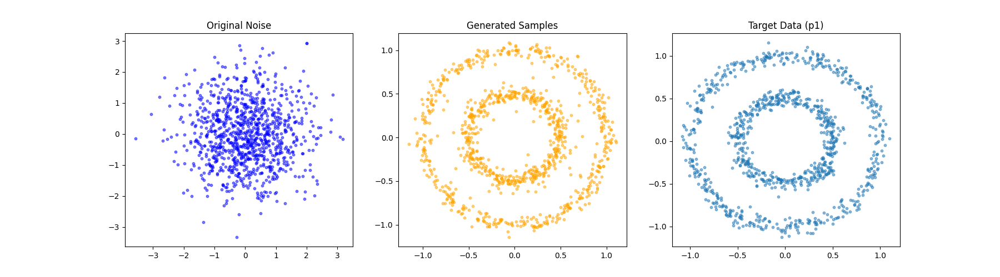

# 2025秋季概率统计与随机过程大作业核心工程内容说明
## **流匹配损失函数构建**：  
* 以简单直线作为条件概率路径，计算目标向量场。  
* 计算单步模型输出与目标向量场之间的均方误差。

## **模型搭建**：  
### 1. 时间嵌入层 (Time Embedding Layer)  
为了让网络能够捕捉到$t \in [0, 1]$过程中的微小动力学变化，我们采用了双重升维策略：  

首先，通过 $t \cdot k\pi$ 将标量 $t$ 映射到 8 个不同的频率空间。利用 $\sin$ 和 $\cos$ 函数生成 16 维的周期性特征向量，克服了神经网络对原始标量输入的谱偏差 (Spectral Bias)。  

其次，使用两层线性层（含 SiLU 激活）将 16 维原始频率特征投影至 64 维的高维嵌入空间。这一步实现了“特征增强”，确保时间信号在后续计算中不会被空间坐标信号淹没。  

### 2. 主干预测网络 (Backbone Network)  
主干网络负责接收融合后的信号并预测当前的漂移速度（Vector Field）：  
* 输入维度: $2 (\text{spatial}) + 64 (\text{temporal}) = 66$ 维。    
* 深度与宽度：采用 4 层 256 维的线性层。  
 初期采用3层MLP，但模型无法捕捉内层圆环特征。增加一层 MLP 是捕捉“内层圆环”的关键。
* 激活函数：全线使用 SiLU (Sigmoid-weighted Linear Unit)。  

**模型数据流**
* 输入:当前粒子位置$x$与时间戳$t$。  
* 升维: $t \xrightarrow{\text{Sin/Cos}} 16d \xrightarrow{\text{Linear}} 64d$ 。  
* 拼接: $[\text{Position}, \text{TimeFeatures}]\in \mathbb{R}^{66}$ 。  
* 映射: $66d \xrightarrow{4\times\text{MLP}}2d$ 。  
* 输出:预测的条件向量场 $u_t^{target}(x)$ ，指导粒子下一步的移动方向。 

## 训练：
核心逻辑：概率路径采样模型并不直接学习终点分布，而是学习将噪声“推”向目标的速度场。在每一个训练迭代中：
* 目标采样 ($x_1$)：从真实数据集中抽取 batch 样本作为流的终点 。  
* 噪声采样 ($x_0$)：从标准正态分布 $\mathcal{N}(0, I)$ 中采样初始点 。
* 路径插值 ($x_t$)：根据线性概率路径 $x_t = (1-t)x_0 + t x_1$ 构造中间状态。
* 损失计算：模型预测 $v_\theta(x_t, t)$，并以理论条件向量场 $u_t^{target} = x_1 - x_0$ 为目标计算均方误差 (MSE) 。

训练代码实现：
```Python
for epoch in range(epochs):
    # 1. 抽取目标数据 batch (x1)
    x1 = get_batch(data, batch_size).to(device)
    
    # 2. 计算流匹配损失
    # 内部包含：采样 t ~ U[0,1], 采样 x0 ~ N(0,I), 构建 xt
    loss = compute_loss(model, x1)
    
    # 3. 显存管理优化
    # 必须使用 .item() 提取标量值，断开计算图引用，防止内存泄漏
    curloss = loss.item() 
    loss_history.append(curloss)
    
    # 4. 反向传播与参数更新
    optimizer.zero_grad()
    loss.backward()
    optimizer.step()
    
    # 5. 学习率动态调整
    # 使用 StepLR 策略，配合 epoch 计数自动进行学习率衰减
    scheduler.step()
```
优化器策略：Step Decay学习率调度。采用分段常数衰减（StepLR），每 5000 个 Epoch 将学习率减半（Gamma=0.5）。  

理论依据：在训练初期，较大的学习率有助于模型快速定位向量场的大致径向结构。随着训练深入，减小的学习率使模型能够精细拟合内层圆环的收敛边界，从而解决“模式丢失”问题。  

实验观察：Loss 与 收敛性数值特性：Loss 曲线在降至 0.8 附近时会出现明显的平台期，此时解 ODE 轨迹，粒子已经能清晰地汇聚成两个同心圆环。


## 推理：
通过数值模拟求解由连续性方程定义的概率流。


## 项目架构与总结
* dataset.py: 生成 2D 目标分布（Concentric Circles）。  
* model.py: 构建预测向量场的 MLP 网络，集成了多维时间嵌入（Time Embedding）。  
* flow_utils.py: 核心逻辑模块，包含  
1.训练目标：条件流匹配损失 $||v_\theta(x_t, t) - (x_1 - x_0)||^2$ 

2.采样器：基于欧拉法（Euler Method）的 ODE 数值求解。
* main.py: 训练循环与超参数控制。
* visualization.py: 不同t的向量场、loss曲线与生成结果的可视化

本项目通过工程手段验证了推导中的核心结论：通过对条件向量场进行加权平均，可以构造出满足连续性方程的边缘向量场。模型成功地将随机粒子的输运过程从 p0 引导至 p1。